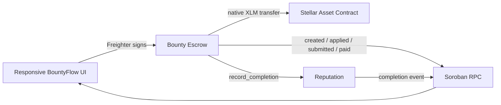

# BountyFlow · Stellar Orange Belt

BountyFlow is a production-shaped marketplace for Web3 work. Project owners fund a bounty in XLM, builders apply and submit proof, and approval releases escrow while updating an on-chain reputation profile.

## Submission links

- Repository: [github.com/Hexdee/bountyflow](https://github.com/Hexdee/bountyflow)
- Live demo: [bountyflow-five.vercel.app](https://bountyflow-five.vercel.app)

## Verified Testnet deployment

| Component | Address | Deployment transaction |
| --- | --- | --- |
| Bounty Escrow | [`CBFJHMUCULC6MDGQLOANO4EWGU4PN3OANUV4FRVAULZABMUZA5F4PFM6`](https://stellar.expert/explorer/testnet/contract/CBFJHMUCULC6MDGQLOANO4EWGU4PN3OANUV4FRVAULZABMUZA5F4PFM6) | [`49da5a…`](https://stellar.expert/explorer/testnet/tx/49da5a766c5086507281d9b79f6498dd27bbe0790c861c820bc10ca2061c1b0b) |
| Reputation | [`CCCRDNK5Z5IRRGGRZ43K3Z6NCCZFCLBYZ7ZTJDEASWEYVIQUS2IKS5YY`](https://stellar.expert/explorer/testnet/contract/CCCRDNK5Z5IRRGGRZ43K3Z6NCCZFCLBYZ7ZTJDEASWEYVIQUS2IKS5YY) | [`15bf22…`](https://stellar.expert/explorer/testnet/tx/15bf22b24e4e10ad828b9ce07555e1b910c65e8d6bb72271f3497aac51c4ea9d) |

Seeded demo bounty transaction: [`8631c952…`](https://stellar.expert/explorer/testnet/tx/8631c95294ad99c8a585367e8cca9ad89cba6ca42a86396f5709636fe499cbe0)

## Architecture



## Level 3 requirements

- Advanced smart contract logic: funded escrow, lifecycle state machine, authenticated creator/builder actions, deadline validation, refund, payout, and reputation accounting.
- Inter-contract communication: `bounty-escrow` invokes `reputation.record_completion` only after an approved payout.
- Event streaming: frontend polls Soroban RPC `getEvents` every 8 seconds and links events to Stellar Expert.
- CI/CD: GitHub Actions runs Rust formatting, contract tests, frontend tests, type-checking, and the production build.
- Deployment workflow: `scripts/deploy-testnet.mjs` uploads, deploys, initializes, and seeds the two-contract system with a demo bounty.
- Mobile responsive frontend: marketplace cards, detail actions, forms, and navigation adapt below 620px.
- Error/loading states: wallet gating, Friendbot guidance, simulation failures, transaction confirmation, empty states, and disabled actions.
- Tests: contract lifecycle coverage plus four frontend utility tests.
- Production architecture: domain contracts, typed conversion helpers, explicit configuration, isolated deployment script, and CI verification.

## Run locally

```sh
pnpm install --no-frozen-lockfile
cp .env.example .env
pnpm test
pnpm build
pnpm dev
```

The app always requires a connected Freighter wallet on Stellar Testnet. A wallet must be funded through [Friendbot](https://friendbot.stellar.org/) before Horizon can load it.

## Deploy fresh contracts

```sh
cargo test
stellar contract build --manifest-path Cargo.toml --out-dir artifacts
env STELLAR_SECRET="$(stellar keys secret alice)" node scripts/deploy-testnet.mjs
```

The deployer writes contract IDs, WASM hashes, deployment transaction hashes, initialization transaction hashes, and the seeded demo bounty transaction to `deployments.testnet.json`. Copy the generated IDs into `.env` before running the frontend.

## End-to-end demo path

1. Connect a funded Freighter wallet on Testnet.
2. Open the seeded bounty and apply from a builder wallet.
3. Submit a GitHub PR or demo URL as proof.
4. Switch to the bounty owner wallet and approve the payout.
5. Confirm the XLM transfer, `paid` event, and Reputation completion event in the live activity feed.

For a public submission, the final account-owned items are the GitHub repository URL, hosted Vercel/Netlify URL, screenshots, and 1–2 minute demo video. No credentials or wallet secrets belong in this repository.
