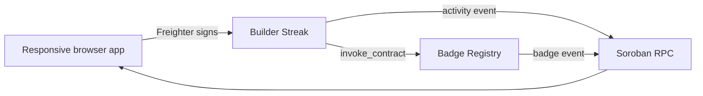

# Builder Streak · Stellar Orange Belt

Builder Streak is a small production-shaped Stellar dApp built for the Rise In Orange Belt challenge. Builders connect a wallet and log activity on Testnet. The Builder Streak contract authenticates the builder, stores the activity count, emits an event, and calls the Badge Registry contract. The registry validates the caller, stores the derived badge level, and emits its own event.

## Architecture



## Orange Belt checklist

- Advanced contract logic: authenticated writes, persistent storage, cross-contract invocation, derived badge levels.
- Inter-contract communication: `builder-streak` calls `badge-registry` through `Env::invoke_contract`.
- Event streaming: the UI polls Soroban RPC `getEvents` every 8 seconds and links each event to Stellar Expert.
- CI/CD: GitHub Actions workflow runs Rust tests, frontend tests, type-checking, and production build.
- Deployment workflow: `scripts/deploy-testnet.mjs` uploads, deploys, initializes both contracts, and records a first interaction.
- Responsive frontend: mobile layout, loading states, disabled actions, wallet errors, RPC errors, and transaction links.
- Tests: two Soroban unit tests plus three frontend tests.
- Documentation: this README plus deployment metadata in `deployments.testnet.json`.

## Testnet deployment

| Contract | Address |
| --- | --- |
| Builder Streak | [`CA5LEQGMOZOSMSEOL5BXJBR3DLDN6G3EVS4EY7AKZ2OYV7MUEH2MB4XW`](https://stellar.expert/explorer/testnet/contract/CA5LEQGMOZOSMSEOL5BXJBR3DLDN6G3EVS4EY7AKZ2OYV7MUEH2MB4XW) |
| Badge Registry | [`CDXVVODRYJAN5IALGRGX2PDVORKURYAQG5AJNF4M4HCN42RES3OS6TV4`](https://stellar.expert/explorer/testnet/contract/CDXVVODRYJAN5IALGRGX2PDVORKURYAQG5AJNF4M4HCN42RES3OS6TV4) |

First interaction transaction: [`b87b96a3f4c01aa450bb2db7b34c4799e06a955daeed4fb09027e517b08cf7cd`](https://stellar.expert/explorer/testnet/tx/b87b96a3f4c01aa450bb2db7b34c4799e06a955daeed4fb09027e517b08cf7cd)

## Run locally

```sh
pnpm install --no-frozen-lockfile
pnpm test
pnpm build
pnpm dev
```

Copy `.env.example` to `.env` and add the two deployed contract IDs. A read-only profile loads without Freighter; connecting Freighter enables the `Log activity` transaction flow.

## Deploy a fresh pair

The deploy script requires a funded Testnet identity exposed only for the command invocation:

```sh
cargo test
stellar contract build --manifest-path Cargo.toml --out-dir artifacts
env STELLAR_SECRET="$(stellar keys secret alice)" node scripts/deploy-testnet.mjs
```

The script writes contract IDs, WASM hashes, deployment hashes, initialization hashes, and the first activity transaction to `deployments.testnet.json`.

## Submission items still requiring account access

The code and deployment are ready locally. A public GitHub URL, hosted Vercel/Netlify URL, and 1–2 minute demo video require the owner’s GitHub/hosting/video accounts, so those are intentionally left as final handoff steps rather than committing credentials or publishing to an account without authorization.
