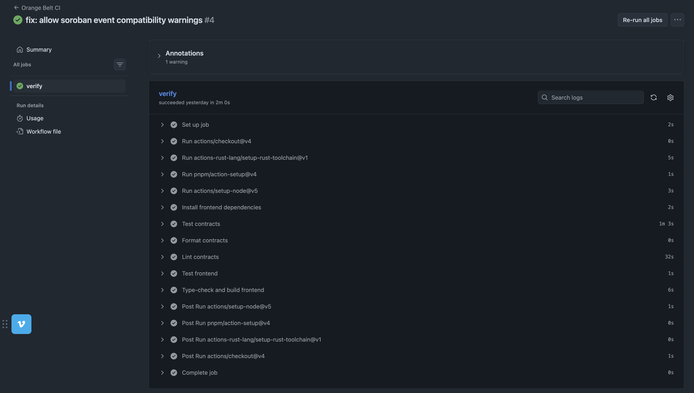
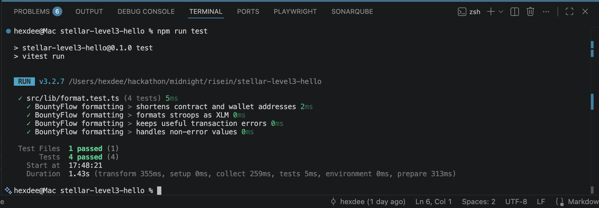

# BountyFlow · Orange Belt submission pack

## Public links

- GitHub repository: [github.com/Hexdee/bountyflow](https://github.com/Hexdee/bountyflow)
- Live demo: [bountyflow-five.vercel.app](https://bountyflow-five.vercel.app)
- Demo video: [YouTube](https://youtu.be/iA_q78Owg0k)

## Testnet deployment

- Network: Stellar Testnet
- Bounty Escrow: [`CBFJHMUCULC6MDGQLOANO4EWGU4PN3OANUV4FRVAULZABMUZA5F4PFM6`](https://stellar.expert/explorer/testnet/contract/CBFJHMUCULC6MDGQLOANO4EWGU4PN3OANUV4FRVAULZABMUZA5F4PFM6)
- Reputation: [`CCCRDNK5Z5IRRGGRZ43K3Z6NCCZFCLBYZ7ZTJDEASWEYVIQUS2IKS5YY`](https://stellar.expert/explorer/testnet/contract/CCCRDNK5Z5IRRGGRZ43K3Z6NCCZFCLBYZ7ZTJDEASWEYVIQUS2IKS5YY)
- Native XLM asset contract: `CDLZFC3SYJYDZT7K67VZ75HPJVIEUVNIXF47ZG2FB2RMQQVU2HHGCYSC`

## Interaction evidence

- Final payout transaction hash: `62f8b638cf9e13e3613912a545141da0c199275c5d32883d63dd0449785c3516`
- [Open payout transaction in Stellar Expert](https://stellar.expert/explorer/testnet/tx/62f8b638cf9e13e3613912a545141da0c199275c5d32883d63dd0449785c3516)
- User-provided explorer reference: [16598330612154368](https://stellar.expert/explorer/testnet/tx/16598330612154368#16598330612154369)

The payout transaction was verified against Stellar Testnet RPC with status `SUCCESS` in ledger `3864600`.

## Required screenshots

### Mobile responsive UI

### CI/CD pipeline passing

### Frontend test output

## Demo flow

1. Owner creates and funds a bounty in XLM.
2. Builder connects a second wallet and applies.
3. Builder submits a proof URL.
4. Owner approves the work and releases escrow.
5. The payout and Reputation completion appear in the live event feed.
